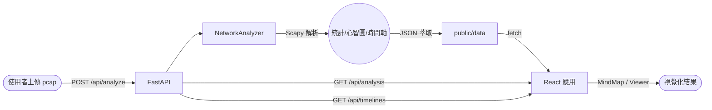

# 專案概覽

`network_img` 為網路流量分析與視覺化平台，結合 **FastAPI + Scapy** 的封包解析後端與 **React + Vite + Tailwind** 的互動前端，協助工程師、品測或營運人員上傳 PCAP/PCAPNG 檔案後快速獲得統計資料、協議行為時間軸、心智圖與多種模擬場景。系統同時支援即時 API 與離線快取 JSON，方便在 demo 或純前端部署時仍可瀏覽既有資料。

## 核心功能與特色
- 封包分析：`NetworkAnalyzer` 讀取封包、計算協議統計、封包遺失、延遲指標，並推導連線摘要與異常偵測線索。
- 多視角呈現：前端提供心智圖 (`MindMap`)、儀表板 (`NetworkAnalysisViewer`)、多個針對 TCP/UDP/HTTP/DNS 等協議的互動教學 Demo。
- 雙模式資料來源：預設以 `/api/*` 取得最新分析，若後端離線則自動改讀 `public/data/*.json` 靜態快取。
- 動畫與互動：`ProtocolAnimationController` 管理時間軸進度、速度與視覺效果，支援暫停、拖曳、聚焦、tooltip 等體驗。
- 可擴充的資料匯出：透過 `scripts/export_protocol_timeline_sample.py` 或 `NetworkAnalyzer.save_results` 將分析結果輸出到 `public/data/` 與 `docs/`，便於版本管理與分享。

## 系統架構



**後端元件職責**
- `analysis_server.py`：FastAPI 服務進入點，定義 `/api/health`、`/api/analysis`、`/api/timelines`、`/api/analyze`，處理檔案上傳、權限、快取與 CORS。
- `network_analyzer.py`：封包解析主體，採 Scapy 逐封包掃描後建立 `analysis_results`，並一路生成心智圖、時間軸與報表。

**前端元件職責**
- `src/App.jsx`：提供多頁籤導覽並載入各測試模組。
- `src/MindMap.jsx`：讀取時間軸資料建立節點、邊與動畫控制器，提供縮放、拖曳、聚焦、上傳等互動。
- `src/NetworkAnalysisViewer.jsx`：統合儀表板與上傳流程，展示封包統計、延遲、熱門連線、遊戲建議等資訊。

## 目錄結構速覽

```text
network_img/
├─ analysis_server.py           # FastAPI 主程式
├─ network_analyzer.py          # Scapy 封包分析核心
├─ public/data/                 # 前端離線快取 JSON
├─ src/                         # React 應用與模組
│  ├─ components/               # TCP/UDP/DNS 等 Demo 與控制元件
│  ├─ lib/                      # 協議狀態、動畫控制器
│  ├─ __tests__/                # Vitest 測試（ProtocolAnimationController）
│  └─ MindMap.jsx / App.jsx ...
├─ docs/                        # 補充文件、設計稿、時間軸匯出
├─ scripts/export_protocol_timeline_sample.py
├─ requirements.txt             # 後端 Python 依賴
└─ package.json                 # 前端 npm 腳本與依賴
```

- `dist/`：`npm run build` 後的產出，可直接靜態部署。
- `node_modules/`、`venv/`：本地依賴環境。
- `network_analysis_report.txt`：CLI 分析產出的文字摘要。
- `network_analysis_results.json`：最近一次分析的完整資料結構。

## 前端（React + Vite）詳細說明
- **技術棧**：React 19、Vite 7、Tailwind CSS（透過 `@tailwindcss/vite`）、Lucide React 圖示、Vitest + Testing Library。
- **資料取得策略**：
  - 優先嘗試 `fetch('/api/analysis')` 與 `fetch('/api/timelines')`（`MindMap` 與 `NetworkAnalysisViewer` 皆如此）。
  - 若 API 回傳 404 或連線失敗，改讀 `public/data/network_analysis_results.json`、`network_mind_map.json`、`protocol_timeline_sample.json`。
  - 上傳檔案後刷新快取；`MindMap` 與 `NetworkAnalysisViewer` 在後端回應成功後會重新載入資料。
- **重要模組**：
  - `components/*Demo.jsx`：以動畫模擬 TCP 三向交握、UDP 傳輸、HTTP 請求、DNS 查詢、Timeout 及異常偵測等情境。
  - `TimelineControl.jsx`：提供播放/暫停、倍速、進度條與聚焦模式切換。
  - `ProtocolFilter.jsx`：依協議類型與端點條件篩選視覺化內容。
  - `assets/`：包含圖示與背景素材，供 UI 使用。
- **動畫控制**：
  - `ProtocolAnimationController` 針對每個 timeline 實例維護 `elapsedMs`、`stageIndex` 與視覺效果 (`blinking`、`pulsing` 等)。
  - 支援 `setPlaybackSpeed`、`seek`、`seekToProgress`、`reset`、`advance` 等介面，供 `MindMap` 與 Demo 元件共用。
  - `ProtocolStates.js` 定義不同協議或示範的階段與色彩映射，可快速擴充自訂協議。
- **測試**：`vitest` 配合 JSDOM，現階段覆蓋動畫控制器邏輯，可視需求擴充到更多 UI 組件。

## 後端（FastAPI + Scapy）詳細說明
- **主要流程**：
  1. 檢查檔名與副檔名（僅允許 `.pcap` / `.pcapng`）。
  2. 必要時複製到臨時檔以處理非 ASCII 路徑。
  3. 呼叫 `NetworkAnalyzer.load_packets()` 透過 Scapy 讀取封包。
  4. 依序執行：`basic_statistics()`、`detect_packet_loss()`、`analyze_latency()`、`build_mind_map()`、`generate_protocol_timelines()`。
  5. 透過 `save_results()` 同步輸出至 `network_analysis_results.json`、`network_mind_map.json`、`protocol_timeline_sample.json`。
- **API 端點**：
  - `GET /api/health`：回傳 `{ status: "ok" }`，供 probe 使用。
  - `GET /api/analysis`：從快取 JSON 讀取最新分析結果，若不存在回傳 404。
  - `GET /api/timelines`：讀取 `protocol_timeline_sample.json`，缺少檔案時回傳 404。
  - `POST /api/analyze`：接受多段表單上傳，觸發分析並回傳 `{"analysis": ...}`。
- **錯誤處理**：對於空檔案、格式錯誤或分析失敗會丟出 4xx/5xx `HTTPException`，同時在伺服器端記錄最後錯誤訊息 (`analyzer.last_error`)。
- **腳本與工具**：
  - `scripts/export_protocol_timeline_sample.py`：將既有封包檔轉成時間軸 fixture，寫入 `docs/` 與 `public/data/`；提供離線流程或版本管控。
  - CLI 模式 `python network_analyzer.py <pcap>` 會在命令列輸出報表並生成 `network_analysis_report.txt`。

## 分析輸出與資料格式
- `public/data/network_analysis_results.json`：主分析檔，包含 `basic_stats`（封包數、協議分佈、端口統計）、`packet_loss`、`latency`（RTT、手shakes、inter-packet delay）、`top_connections` 等結構。
- `public/data/network_mind_map.json`：心智圖節點與連線（節點 IP/Port、協議標籤、連線強度、封包方向）。
- `public/data/protocol_timeline_sample.json`：時間軸集合，內含 `id`、`protocol`、`stages`（名稱、持續時間、方向、狀態）、`metrics`、`startEpochMs`/`endEpochMs` 等欄位。
- `docs/protocol_timeline_sample.json`：與 `public/data` 相同但給文件使用，方便追蹤版控差異。

## 開發與執行流程
1. **Python 環境**
   - `python -m venv venv && venv\Scripts\activate`
   - `pip install -r requirements.txt`
   - 啟動後端：`uvicorn analysis_server:app --host 0.0.0.0 --port 8000 --reload`
2. **Node.js 環境**
   - `npm install`
   - 開發伺服器：`npm run dev`（預設 http://localhost:5173）
   - 正式建置：`npm run build`，成果位於 `dist/`
   - 靜態預覽：`npm run preview`
3. **分析流程**
   - 透過前端「上傳封包」按鈕或直接呼叫 `curl -F file=@capture.pcap http://localhost:8000/api/analyze`
   - 後端會更新 `public/data` 下的 JSON；前端重新整理即可看到最新資訊。

## 品質與維運
- Lint：`npm run lint`
- 前端測試：`npm run test`
- Backfill/fixture 更新：`python scripts/export_protocol_timeline_sample.py <pcap>`
- 推薦將 `public/data/*.json` 納入版本管理，以追蹤分析輸出差異。
- 監控後端健康度時可使用 `GET /api/health`。

## 相關文件與協作資源
- `docs/backend_alignment.md`：API 契約、時間軸資料流程與待確認議題。
- `docs/ui_wireframe_plan.md` / `ui_wireframe_review.md`：UI 草圖、互動預期。
- `docs/protocol_animation_spike.md`：協議動畫技術筆記與實驗結果。
- `CLAUDE.md`：先前使用 Claude 助理的操作紀錄（可作為互動備查）。

## 未來擴充建議（筆記）
- 擴充 `NetworkAnalyzer` 直接輸出更多時間軸欄位，減少離線腳本依賴。
- 在 `NetworkAnalysisViewer` 添加更多 drill-down 視圖（例如單一連線封包序列）。
- 規劃使用者授權或專案切換機制，避免多租戶資料混淆。
- 針對遊戲/串流領域新增特化的建議模組或警示邏輯。
