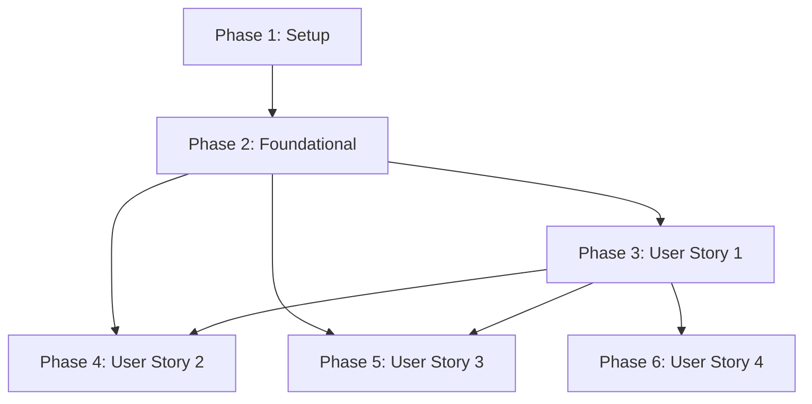

# Implementation Tasks: 網路通訊協議圖形化展示系統

**Feature Branch**: `001-protocol-visualization`
**Generated**: 2025-11-16
**Source**: [spec.md](./spec.md), [plan.md](./plan.md), [data-model.md](./data-model.md)

## Task Overview

**總任務數**: 42 個任務
**MVP 範圍**: Phase 1 + Phase 2 + Phase 3 (User Story 1)
**預估時間**: 2-3 天（依開發者經驗）

### 各階段任務分布

| 階段 | 任務數 | 說明 |
|------|--------|------|
| **Phase 1: Setup** | 6 | 專案初始化與依賴安裝 |
| **Phase 2: Foundational** | 10 | 會話管理、檔案隔離、API 基礎設施 |
| **Phase 3: User Story 1** | 8 | 查看網路協定動畫視覺化（MVP 核心） |
| **Phase 4: User Story 2** | 8 | 上傳並分析 PCAP 檔案 |
| **Phase 5: User Story 3** | 6 | 控制動畫播放與互動 |
| **Phase 6: User Story 4** | 4 | 查看協定統計與拓撲圖 |

### 並行執行機會

- Phase 1 所有任務可並行執行
- Phase 2 的 T007-T010（API 端點）可並行實作
- Phase 3 的 T014-T018（前端元件）可並行實作
- Phase 4 的 T022-T025（上傳流程）可並行實作

---

## Phase 1: Setup

**目標**: 初始化專案環境，安裝必要依賴，配置環境變數

**完成標準**:
- ✅ 所有依賴已安裝無錯誤
- ✅ 環境變數範本已建立
- ✅ 開發伺服器（前後端）可正常啟動

### 任務清單

- [X] T001 [P] 更新 requirements.txt 新增後端依賴（APScheduler==3.10.4, python-dotenv==1.0.0, pytest==7.4.3, httpx==0.25.2）
- [X] T002 [P] 執行 pip install -r requirements.txt 安裝後端依賴
- [X] T003 [P] 建立 .env.example 環境變數範本檔案（SECRET_KEY, SESSION_MAX_AGE, CLEANUP_INTERVAL, LOG_LEVEL）
- [X] T004 [P] 建立 tests/ 目錄結構（tests/test_session_middleware.py, tests/test_file_isolation.py, tests/test_cleanup_scheduler.py, tests/fixtures/）
- [X] T005 [P] 驗證前端依賴已安裝（npm install 確認 package-lock.json 完整）
- [X] T006 同時啟動前後端開發伺服器驗證環境（uvicorn analysis_server:app --reload 與 npm run dev）

---

## Phase 2: Foundational

**目標**: 實作會話管理、檔案隔離、自動清理、API 驗證等核心基礎設施

**完成標準**:
- ✅ SessionMiddleware 正確配置
- ✅ 所有 API 端點（除 /api/health）需要會話驗證
- ✅ 每個會話的檔案隔離於 public/data/<session_id>/
- ✅ APScheduler 每小時自動清理過期會話

**獨立測試**:
```bash
# 測試會話驗證
pytest tests/test_session_middleware.py -v

# 測試檔案隔離
pytest tests/test_file_isolation.py -v

# 測試自動清理
pytest tests/test_cleanup_scheduler.py -v
```

### 任務清單

- [X] T007 在 analysis_server.py 導入 SessionMiddleware 並配置（secret_key 從環境變數載入，max_age=14400，session_cookie='session_id'）
- [X] T008 在 analysis_server.py 實作 require_session() 依賴函數（檢查 request.session['session_id']，未登入返回 401）
- [X] T009 在 analysis_server.py 實作 get_session_data_dir() 輔助函數（返回 Path('public/data')/session_id，自動建立目錄）
- [X] T010 [P] 更新 GET /api/health 端點（無需會話驗證，返回 {"status": "ok", "timestamp": ...}）
- [X] T011 [P] 更新 GET /api/analysis 端點（新增 require_session 依賴，從會話目錄讀取 network_analysis_results.json）
- [X] T012 [P] 更新 GET /api/timelines 端點（新增 require_session 依賴，從會話目錄讀取 protocol_timeline_sample.json）
- [X] T013 [P] 更新 POST /api/analyze 端點（新增 require_session 依賴，將上傳檔案儲存至會話目錄）
- [X] T014 在 analysis_server.py 實作 cleanup_expired_sessions() 函數（掃描 public/data/*，刪除 st_mtime 超過 SESSION_MAX_AGE 的目錄）
- [X] T015 在 analysis_server.py 註冊 APScheduler 啟動事件（@app.on_event('startup')，每小時執行 cleanup_expired_sessions）
- [X] T016 撰寫後端測試 tests/test_session_middleware.py（測試 /api/health 無需驗證，/api/timelines 需要驗證返回 401）

---

## Phase 3: User Story 1 - 查看網路協定動畫視覺化

**User Story**: 網路分析師需要快速理解複雜的網路通訊行為。系統應自動將 PCAP 封包資料轉換為視覺化的協定動畫，讓分析師能直觀地看到 TCP 握手、DNS 查詢、HTTP 請求等協定互動流程。

**Priority**: P1 (MVP 核心功能)

**完成標準**:
- ✅ 系統可載入預先準備的 PCAP 檔案（public/data/protocol_timeline_sample.json）
- ✅ 正確顯示 TCP 三向握手動畫（SYN→SYN-ACK→ACK，顏色正確）
- ✅ 正確顯示 DNS 查詢動畫（查詢→回應，紫色）
- ✅ 正確顯示 HTTP 請求動畫（請求→處理→回應，橙色）
- ✅ 正確顯示逾時動畫（顏色漸變 綠→黃→橙→紅）
- ✅ 所有協定使用不同顏色和視覺樣式區分

**獨立測試**:
```bash
# 前端測試
npm test -- MindMap.test.jsx

# 手動測試
1. 啟動 npm run dev
2. 訪問 http://localhost:5173/
3. 驗證預載動畫正確顯示
```

### 任務清單

- [ ] T017 [US1] 在 network_analyzer.py 確認 generate_protocol_timelines() 正確生成 protocolType 欄位（tcp-handshake, dns-query, http-request, https-request, udp-transfer, timeout）
- [ ] T018 [US1] 在 network_analyzer.py 確認 _extract_tcp_handshakes() 正確偵測 SYN, SYN-ACK, ACK 階段並設定最小持續時間 800ms
- [ ] T019 [US1] 在 network_analyzer.py 確認 _extract_udp_transfers() 正確偵測 DNS 查詢（port 53）並設定最小持續時間 1200ms
- [ ] T020 [US1] 在 network_analyzer.py 確認 _detect_http_requests() 正確偵測 HTTP/HTTPS（port 80/443）並設定階段最小持續時間 600ms
- [ ] T021 [US1] 在 src/lib/ProtocolStates.js 確認所有協定類型已定義完整階段資訊（tcp-handshake, dns-query, http-request, https-request, udp-transfer, timeout）
- [ ] T022 [P] [US1] 在 src/lib/ProtocolAnimationController.js 確認 advance(delta) 正確推進動畫進度並更新 currentStage
- [ ] T023 [P] [US1] 在 src/lib/ProtocolAnimationController.js 確認 getRenderableState() 返回正確的圓點位置、顏色、標籤
- [ ] T024 [US1] 在 src/MindMap.jsx 確認 requestAnimationFrame 循環正確驅動所有動畫控制器（呼叫 controller.advance(delta)）
- [ ] T025 [US1] 在 src/MindMap.jsx 確認動畫圓點與標籤正確渲染（協定類型標籤在上方白色，階段標籤在下方青色）
- [ ] T026 [US1] 手動測試：載入 public/data/protocol_timeline_sample.json，驗證 TCP/DNS/HTTP/HTTPS/UDP/Timeout 動畫正確播放

---

## Phase 4: User Story 2 - 上傳並分析 PCAP 檔案

**User Story**: 網路分析師需要分析自己捕獲的網路封包。系統應支援上傳 PCAP/PCAPNG 檔案，自動解析封包內容，生成協定時間軸，並將結果以視覺化方式呈現。

**Priority**: P2

**完成標準**:
- ✅ 用戶可上傳 .pcap 或 .pcapng 檔案
- ✅ 系統驗證檔案格式，拒絕非 PCAP 檔案（返回 400）
- ✅ 未登入用戶上傳檔案返回 401
- ✅ 上傳後系統自動解析並刷新畫面顯示新動畫
- ✅ 大型檔案上傳顯示進度指示器
- ✅ 損壞封包被跳過並顯示警告訊息

**獨立測試**:
```bash
# 後端測試
pytest tests/test_file_upload.py -v

# 手動測試
1. 啟動前後端
2. 上傳測試用 PCAP 檔案（tests/fixtures/sample.pcap）
3. 驗證動畫更新
```

### 任務清單

- [ ] T027 [US2] 在 analysis_server.py 的 POST /api/analyze 端點新增檔案格式驗證（只接受 .pcap 或 .pcapng，其他返回 400）
- [ ] T028 [US2] 在 analysis_server.py 的 POST /api/analyze 端點實作檔案儲存至會話目錄（session_dir / 'uploaded.pcap'）
- [ ] T029 [US2] 在 analysis_server.py 的 POST /api/analyze 端點呼叫 NetworkAnalyzer 執行解析（load_packets → generate_protocol_timelines → save_results）
- [ ] T030 [US2] 在 analysis_server.py 的 POST /api/analyze 端點處理損壞封包（捕獲 Scapy 異常，跳過無效封包，返回警告訊息）
- [ ] T031 [P] [US2] 在 src/MindMap.jsx 實作檔案上傳 UI（handleFileUpload 函數，使用 FormData 送出 POST /api/analyze）
- [ ] T032 [P] [US2] 在 src/MindMap.jsx 實作上傳進度指示器（顯示 '正在上傳...' 訊息）
- [ ] T033 [US2] 在 src/MindMap.jsx 處理上傳錯誤（顯示錯誤訊息，401 重導向登入，400 顯示格式錯誤）
- [ ] T034 [US2] 在 src/MindMap.jsx 實作上傳完成後自動刷新（重新呼叫 loadTimelines 載入新資料）
- [ ] T035 [US2] 撰寫測試 tests/test_file_upload.py（測試格式驗證、會話隔離、損壞封包處理）

---

## Phase 5: User Story 3 - 控制動畫播放與互動

**User Story**: 網路分析師在查看複雜的協定互動時，需要能夠暫停、播放、調整速度，以及聚焦於特定連線進行詳細觀察。

**Priority**: P3

**完成標準**:
- ✅ 暫停/播放按鈕正確控制所有動畫
- ✅ 點擊連線可選中（高亮顯示）
- ✅ 焦點模式只顯示選中連線並自動暫停
- ✅ 懸停連線顯示浮動提示框（100ms 內出現）
- ✅ 懸停時其他連線透明度降至 15%
- ✅ 側邊欄與圖上連線同步選中狀態

**獨立測試**:
```bash
# 前端測試
npm test -- InteractionControls.test.jsx

# 手動測試
1. 載入包含 10+ 連線的 PCAP
2. 測試暫停/播放
3. 測試點擊選中
4. 測試焦點模式
5. 測試懸停互動
```

### 任務清單

- [ ] T036 [P] [US3] 在 src/MindMap.jsx 實作暫停/播放功能（isPaused state，控制 controller.advance() 是否執行）
- [ ] T037 [P] [US3] 在 src/MindMap.jsx 實作連線選中功能（selectedConnectionId state，點擊連線設定，點擊側邊欄同步）
- [ ] T038 [US3] 在 src/MindMap.jsx 實作焦點模式（isFocusMode state，只渲染選中連線，進入時自動暫停）
- [ ] T039 [P] [US3] 在 src/MindMap.jsx 實作懸停互動（hoveredConnectionId state，設定高亮與透明度，顯示浮動提示框）
- [ ] T040 [P] [US3] 在 src/MindMap.jsx 實作浮動提示框（顯示協定類型、當前階段、進度百分比，位置跟隨滑鼠）
- [ ] T041 [US3] 在 src/MindMap.jsx 實作側邊欄連線清單渲染（顯示協定圖示、階段名稱、進度百分比、來源/目的 IP）

---

## Phase 6: User Story 4 - 查看協定統計與拓撲圖

**User Story**: 網路分析師需要了解整體網路結構和協定分布情況。系統應提供網路拓撲圖（力導向圖），顯示所有 IP 節點及其連線關係，並支援拖曳節點調整布局。

**Priority**: P4

**完成標準**:
- ✅ 力導向拓撲圖正確顯示所有 IP 節點
- ✅ 中心節點（連線數最多）固定於畫面中央
- ✅ 節點可拖曳，拖曳時力導向模擬暫停
- ✅ 30 個節點在 3 秒內達到穩定布局（無重疊）
- ✅ 布局穩定後自動執行 Fit-to-View
- ✅ 重置視圖按鈕正確重置縮放與平移

**獨立測試**:
```bash
# 前端測試
npm test -- ForceDirectedGraph.test.jsx

# 手動測試
1. 載入包含 30+ 節點的 PCAP
2. 驗證節點分布均勻無重疊
3. 測試拖曳節點
4. 測試重置視圖
```

### 任務清單

- [ ] T042 [P] [US4] 在 src/MindMap.jsx 確認 buildNodeLayout() 正確識別中心節點（連線數最多的 IP）並固定於畫布中央
- [ ] T043 [P] [US4] 在 src/MindMap.jsx 確認力導向圖五種力正確實作（斥力、引力、重力、碰撞力、邊界力）
- [ ] T044 [US4] 在 src/MindMap.jsx 確認節點拖曳功能（draggingNodeId state，onMouseDown/Move/Up 事件，拖曳時暫停模擬）
- [ ] T045 [US4] 在 src/MindMap.jsx 確認穩定性偵測與自動 Fit-to-View（總動能低於閾值時觸發 fitToView() 函數）
- [ ] T046 [US4] 在 src/MindMap.jsx 確認重置視圖功能（resetView() 設定 viewTransform 為初始值 scale=1, tx=0, ty=0）
- [ ] T047 [US4] 在 src/MindMap.jsx 確認 NaN 座標防護（isFinite 檢查，檢測到 NaN 重置到畫布中心並清零速度）

---

## Implementation Strategy

### MVP 優先（最小可行產品）

**MVP 範圍**: Phase 1 + Phase 2 + Phase 3

包含任務：T001-T026（共 26 個任務）

**MVP 交付成果**:
- ✅ 完整的會話管理與檔案隔離
- ✅ 預載 PCAP 檔案的動畫視覺化
- ✅ 所有協定類型（TCP/DNS/HTTP/HTTPS/UDP/Timeout）正確顯示

### 增量交付順序

1. **第一版**: MVP（User Story 1）
2. **第二版**: 新增上傳功能（User Story 2）
3. **第三版**: 新增互動控制（User Story 3）
4. **第四版**: 新增拓撲圖（User Story 4）

---

## Dependencies

### User Story 完成順序



**關鍵依賴**:
- User Story 2-4 都依賴 User Story 1（核心動畫系統）
- User Story 1 依賴 Foundational（會話管理、API 基礎設施）
- Foundational 依賴 Setup（環境配置）

**獨立性**:
- User Story 2、3、4 之間相互獨立，可並行開發

---

## Parallel Execution Examples

### Phase 2 Foundational 並行執行範例

```bash
# 終端機 1: 實作 API 端點
# T010, T011, T012, T013 可同時編輯不同端點

# 終端機 2: 實作會話中介軟體
# T007, T008, T009 修改 analysis_server.py 不同函數

# 終端機 3: 實作清理排程器
# T014, T015 獨立功能

# 終端機 4: 撰寫測試
# T016 獨立測試檔案
```

### Phase 3 User Story 1 並行執行範例

```bash
# 終端機 1: 後端時間軸生成
# T017, T018, T019, T020 修改 network_analyzer.py

# 終端機 2: 前端動畫控制器
# T022, T023 修改 ProtocolAnimationController.js

# 終端機 3: 前端動畫渲染
# T024, T025 修改 MindMap.jsx
```

---

## Task Checklist Format Reference

**格式說明**:
- `- [ ]` : 任務核取方塊（未完成）
- `T001` : 任務唯一識別碼（按執行順序編號）
- `[P]` : 可並行執行標記（不同檔案或無依賴）
- `[US1]` : 所屬 User Story 標籤（US1=User Story 1, US2=User Story 2...）
- 任務描述必須包含明確的檔案路徑

**範例**:
```markdown
- [ ] T012 [P] [US1] 在 src/models/user.py 建立 User 模型類別
```

---

**Tasks Version**: 1.0
**Generated By**: `/speckit.tasks`
**Ready for**: `/speckit.implement` 或手動實作
**估計完成時間**: 2-3 天（全職開發者）
